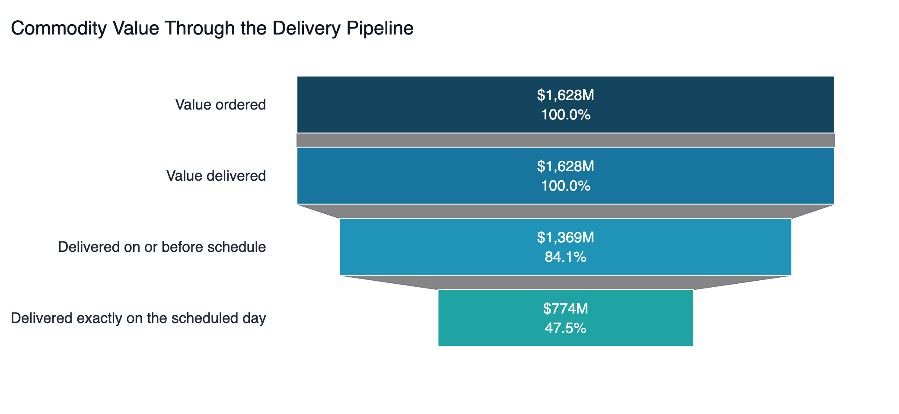
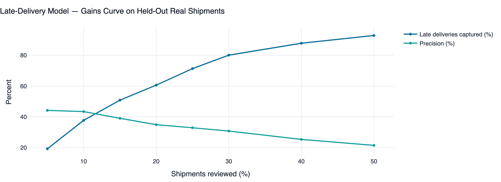
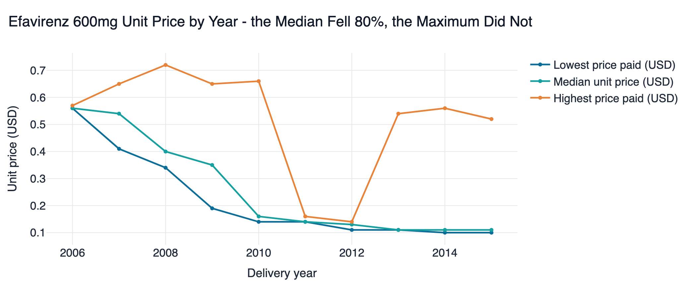

# Pharmaceutical Supply Chain Optimization

### Delivery funnel · Data quality · Machine learning · Procurement pricing

An end-to-end analytics platform on **two real pharmaceutical datasets**: where $259M
of commodity value arrives late across 10,324 actual USAID shipments, whether the
prices paid for identical products were consistent, and two ML pipelines with honest
evaluation. No simulated data anywhere in the project.

[](https://www.python.org/)
[](https://scikit-learn.org/)
[](https://streamlit.io/)
[](tests/)
[](https://colab.research.google.com/github/gitPiyush2004/Pharmaceutical-Supply-Chain-Optimization/blob/main/notebooks/drug_classification_pipeline.ipynb)

```bash
git clone https://github.com/gitPiyush2004/Pharmaceutical-Supply-Chain-Optimization.git
cd Pharmaceutical-Supply-Chain-Optimization
pip install -r requirements.txt

python scripts/fetch_data.py       # verify the datasets are present
python scripts/train_models.py     # train both models
streamlit run app/Home.py          # launch the dashboard
```

## Data

| Dataset | Size | Used for |
|---|---|---|
| Kaggle [`drug200`](https://www.kaggle.com/datasets/prathamtripathi/drug-classification) | 200 patients | Drug recommendation model |
| [USAID SCMS delivery history](https://www.kaggle.com/datasets/sawandikirby/supply-chain-shipment-pricing-data) | 10,324 shipments, 43 countries, 2006–2015 | Delivery funnel, pricing, data quality, late-delivery model |

Both are public and tracked in the repository, so a clone works immediately.
`scripts/fetch_data.py --verify` checks row counts, so a truncated download fails
loudly rather than putting quietly wrong numbers on a page.

**SCMS does double duty, which is why there is no third dataset.** Every line item
carries the molecule, brand, dosage, factory *and* the price actually paid, so "did it
arrive on time?" and "did we pay a fair price?" are answered on the same rows.

---

## 1 · Where value arrives late



**$1.63B ordered and 100% delivered, but only 84.1% arrives on or before schedule —
leaving $259M late — and just 47.5% arrives on exactly the promised day.** Tolerate a
week of slippage and 89.5% of value is safe; at 30 days, 97.8%. The exposure is a
short tail, not a network-wide failure.

There is no unit-attrition funnel here, and that is a finding rather than a gap. SCMS
states `Line Item Quantity` once at order time and never restates it at delivery, and
every line item was ultimately delivered — units draining between stages would have
been invented. What *is* measurable is attrition in timeliness, so each band above is
a strictly tighter definition of on time than the one before it.

Two figures qualify the headline. **61% of shipments land on exactly their scheduled
day** — implausibly precise for international freight, and a sign the scheduled date
is sometimes back-filled from the actual one. And **27% arrive early**, counted as
success by the on-time metric though early arrivals carry holding cost.

---

## 2 · Machine learning

### Drug classification — 98% accuracy, and why that is not the point

Decision Tree with balanced class weights, selected on cross-validated macro F1:
0.988 macro F1, 0.989 AUC, one error on the held-out set.

> **The label is a pure function of the features** — verified, with zero exceptions:
> `Na_to_K >= 15.015` gives DrugY, and below that threshold blood pressure,
> cholesterol and a single age cut resolve the remaining four exactly. 100% is
> arithmetically attainable, so 98% is not an achievement. What this section
> demonstrates is pipeline rigour.

**Cross-validated accuracy plateaus at 99.5% for every depth from 4 upward** (depth 3
reaches only 88.5%), and on 200 rows 99.5% is exactly one patient — sample size, not
capacity: the true boundary sits between 14.642 and 15.015, and a tree fitted on 150
rows does not always split inside that gap. The single test error is at Na/K 14.64,
the boundary value itself — **and that patient was predicted with 100% confidence.** A
tree grown to pure leaves calls every prediction certain, so the obvious safety net
(escalate low-confidence cases to a pharmacist) cannot be built until the
probabilities are calibrated.

### Late delivery — when accuracy is the wrong metric



XGBoost on the real SCMS shipments. **ROC AUC 0.848, but accuracy 0.881 — *below* the
0.885 majority-class baseline**, because only 11.5% of shipments are late; always
predicting "on time" would score better. That is not a failure, it means accuracy is
the wrong question. The deployable output is the ranking: **reviewing the top 20% by
predicted risk catches 63.3% of all late deliveries, a 3.2× lift over random** — an
expeditor's work queue, not a yes/no gate.

Leakage control is the part worth asking about. Every lead-time measure except the
*scheduled* one is derived from the delivery date and would leak the answer. Vendor
identity is excluded too: with 73 vendors, several appearing a handful of times, the
model would memorise suppliers instead of learning transferable structure.

---

## 3 · A grade-A data quality score can be worthless

SCMS scores **99.3% complete, grade A** on generic profiling, yet **55% of
purchase-order dates and 40% of freight costs are unusable**. The defects are
*semantic*: the values are strings — `N/A - From RDC`, `Pre-PQ Process`, `Freight
Included in Commodity Cost` — sitting in text columns, perfectly non-null and
completely unparseable.

**Parsing the file correctly lowers its score by 1.70 points**, because honest nulls
score worse on completeness than non-null garbage. Any pipeline judged on *did the
quality score improve* would be incentivised to leave the garbage in place.

The right response is not imputation. `N/A - From RDC` is a **structural absence** —
no vendor purchase order existed, because the goods came from distribution centre
stock — and a mode-imputer would have fabricated 5,404 purchase orders, corrupting
every lead-time figure downstream. Each value gets a reason code instead (`parsed`,
`structural`, `missing`, `cross_reference`) and is excluded from the affected
statistic.

---

## 4 · Did we pay a consistent price?



| Price spread for identical products | Result |
|---|---|
| **Pooled 2006–2015** | **5.0×** across 30 products |
| **Within a single year** | **2.5×** across 89 product-years |

The pooled figure is inflated by exactly a factor of two, because antiretroviral prices
collapsed over the decade — **Efavirenz 600mg fell 80%**, a median of $0.56 in 2006 to
$0.11 in 2015 — so comparing a 2006 purchase with a 2015 one measures *when* you
bought, not *who* from. Every comparison in this project is stratified by era before it
is quoted, for exactly this reason.

Look at the top line of that chart, though: the median collapses to $0.11 while the
**maximum paid stays near $0.52 right through to 2015** — a 5× gap inside a single
year, on a product where the cheap option was demonstrably available. Correcting for
the pooling removes an artefact without removing the finding.

**And the remaining 2.5× is not noise.** Where both a generic and an
originator-branded version of the same product were bought in the same year, the
branded one costs a median of **2.1× more** across 41 product-years. Nevirapine 200mg
is the clearest case:

| Supplier | Brand | Median unit price | On-time |
|---|---|---|---|
| Three Indian factories | Generic | **$0.050** | 86–100% |
| Boehringer Ingelheim, Greece | Viramune | **$0.335** | 100% |

6.7× for the same molecule at the same strength in the same year — but the expensive
supplier delivered 100% on time against 86% for the cheapest. **The premium buys
something.** Whether it is worth 6.7× is a procurement judgement the data does not
settle; what the data settles is that the choice exists and what each side costs.
Spend is concentrated enough for this to matter: **63% of priced value sits in five
products, 94% in fifteen**, out of 92.

---

## The dashboard and the code

Nine Streamlit pages: executive summary, a type-aware quality audit of both datasets,
both models with full evaluation and live prediction, the delivery pipeline, vendors
and logistics, product and pricing, statistical testing, insights stated with what each
does *not* establish, and the reproducible Colab notebook.

**Python** · pandas · NumPy · scikit-learn · XGBoost · SciPy · statsmodels · Plotly ·
Streamlit · pytest. Analytics in `src/analytics`, models in `src/ml`, scoring in
`src/quality`, charts in `src/viz`, every threshold in `config/config.yaml`, and 147
tests in `tests/`.

## Limitations

- **These are observational comparisons, not randomised experiments.** Nobody assigned
  a shipment to a route or a supplier, so a difference identifies where to look, not
  what caused it. Every comparison on the dashboard names its confound.
- **One assumed number.** SCMS records no penalty cost, so any dollar impact applies a
  configured SLA rate (`economics.late_shipment_penalty`) to measured counts.
- **No stability or batch-risk analysis.** No public dataset carries per-batch storage
  telemetry — Kaggle, openFDA, data.gov.in, CDSCO, Mendeley and Zenodo were checked,
  and the one promising candidate was a simulation. Those analyses were dropped rather
  than generated.
- **The pricing analysis covers 82.9% of line items.** The rest carry no usable unit
  price; they are excluded rather than counted as $0.
- **The branded premium is a measured fact, not an established overpayment.** Freight
  terms, volume commitments and registration status are all plausible explanations and
  none is recorded.
- **The SCMS data ends in 2015**, and the analysis shows the network changed materially
  mid-sample.

## Documentation

- **[docs/ARCHITECTURE.md](docs/ARCHITECTURE.md)** — module design and the reasoning
  behind each decision
- **[docs/INTERVIEW_GUIDE.md](docs/INTERVIEW_GUIDE.md)** — how to present this project

---

**Piyush Bhatia** — a portfolio project demonstrating end-to-end analytics
engineering: data quality, ML pipelines, statistical inference and decision support.
