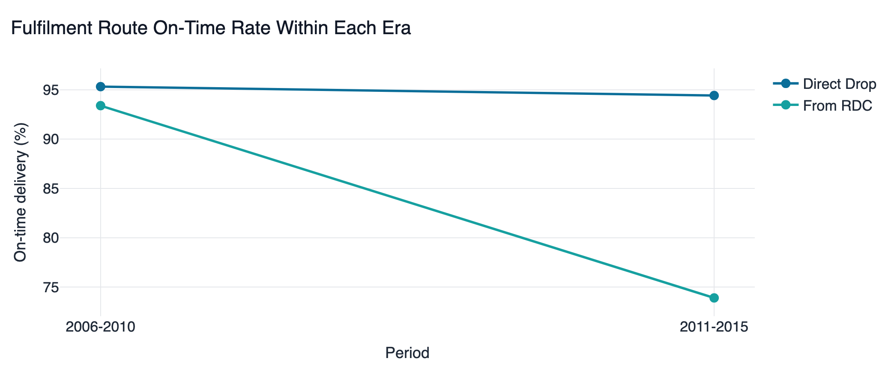

# Pharmaceutical Supply Chain Optimization

### Delivery pipeline analytics · Statistical testing · Machine learning

An end-to-end analytics platform on **two real pharmaceutical datasets**: where
$259M of commodity value arrives late across 10,324 actual USAID shipments, whether
the prices paid for identical products were consistent, which of those differences
survive a statistical test, and two ML pipelines with honest evaluation.

No simulated data anywhere in the project.

[](https://www.python.org/)
[](https://scikit-learn.org/)
[](https://streamlit.io/)
[](tests/)
[](https://colab.research.google.com/github/gitPiyush2004/Pharmaceutical-Supply-Chain-Optimization/blob/main/notebooks/drug_classification_pipeline.ipynb)

---

## Quick start

```bash
git clone https://github.com/gitPiyush2004/Pharmaceutical-Supply-Chain-Optimization.git
cd Pharmaceutical-Supply-Chain-Optimization
pip install -r requirements.txt

python scripts/fetch_data.py       # verify the datasets are present
python scripts/train_models.py     # train both models
streamlit run app/Home.py          # launch the dashboard
```

## Data

| Dataset | Size | Used for |
|---|---|---|
| Kaggle [`drug200`](https://www.kaggle.com/datasets/prathamtripathi/drug-classification) | 200 patients | Drug recommendation model |
| [USAID SCMS delivery history](https://www.kaggle.com/datasets/sawandikirby/supply-chain-shipment-pricing-data) | 10,324 shipments, 43 countries, 2006–2015 | Pipeline, vendor, logistics, **product catalogue and pricing**, statistical testing, late-delivery model |

Both are public and need no authentication, and both are tracked in the repository,
so a clone works immediately. `python scripts/fetch_data.py --verify` checks row
counts, so a truncated download fails loudly rather than putting quietly wrong
numbers on a page.

**SCMS does double duty, which is why there is no third dataset.** It is usually
described as a logistics file, but every line item also carries the molecule, brand,
dosage, dosage form, factory and the price actually paid — 184 catalogue items, 86
molecules, 88 factories. So "did it arrive on time?" and "did we pay a fair price?"
are answered on the *same rows*. An earlier version used a separate 253,973-row Indian
medicine catalogue for the pricing work; it was dropped because it carried list prices
for products nobody in the dataset bought. Scale is not evidence.

Every figure in this repository is measured from these two files.

---

## 1 · Where value arrives late


**There is no unit-attrition funnel here, and that is a finding rather than a
gap.** SCMS states `Line Item Quantity` once at order time and never restates it
at delivery — no ordered-versus-received pair, no scrap quantity, no per-stage
weight. Every line item in the file was ultimately delivered. A chart showing
units draining between stages would have been invented.

What *is* measurable is attrition in timeliness, so each band above is a strictly
tighter definition of on time than the one above it:

- **$1.63B ordered**, 100% delivered
- **84.1% arrives on or before schedule** — leaving **$259M late**
- Only **47.5% arrives on exactly the promised day**

Two figures qualify the headline. **61% of shipments land on exactly their
scheduled day**, which is implausibly precise for international freight and
suggests the scheduled date is sometimes back-filled from the actual one. And
**27% arrive early** — counted as success by the on-time metric, but early arrivals
carry holding cost.

---

## 2 · Statistical testing on real groups



The worst fulfilment route is the programme's own regional distribution centre,
82.9% on time against 94.7% for direct drop (z = −18.9, p = 7.5e-80). **The pooled
11.9-point gap is misleading, and that is the more interesting result.** Stratified
by era:

| Era | Direct Drop | From RDC | Gap |
|---|---|---|---|
| 2006–2010 | 95.3% | 93.4% | +1.9 pp |
| 2011–2015 | 94.4% | **73.9%** | +20.5 pp |

**Precisely: this is effect modification, not textbook Simpson's paradox** — the
direction never reverses, direct drop is ahead in both eras. What changes is the
magnitude, by a factor of ten. The consequence is the same and the code distinguishes
the two cases (`is_simpsons_paradox` requires a sign flip; this one trips
`interaction_detected`), because claiming a reversal that did not happen is the kind
of overstatement an interviewer will check.

The two readings imply opposite actions. A constant 12-point gap says *stop using the
channel*. A post-2010 collapse says *the channel worked, something changed in 2011,
and finding out what is the highest-value question here*. Reporting the pooled figure
would have sent an investigation in entirely the wrong direction.

**Reporting a null result properly.** First-line designation shows 88.56% against
88.40%, p = 0.812. The tempting move is to quote post-hoc power — but post-hoc
power is computed at the *observed* effect size, so a null mechanically returns a
low value (6% here) and using it is circular. The right tool is the **minimum
detectable effect**: at these sample sizes this comparison could have found a gap
of 1.82 points. So it rules out anything larger than that — a real, quotable bound
— while not quite excluding a difference small enough to matter marginally.

**Choosing the right test.** Freight as a share of value has a mean of 2,548%
against a median of 10.6% (skew 78). Compared across product group, Welch's t-test
returns p = 0.44 and Mann-Whitney p = 6.0e-10 on the *same* data. The project runs
both against a configured skew threshold and states which to quote — including the
case where the disagreement runs the other way and *both* are right about
different things.

---

## 3 · Machine learning

### Drug classification — 98% accuracy, and why that is not the point


Decision Tree with balanced class weights, selected on cross-validated macro F1.
0.988 macro F1, 0.989 AUC.

> **The label is a pure function of the features** — verified, with zero
> exceptions: `Na_to_K >= 15.015` gives DrugY, and below that threshold blood
> pressure, cholesterol and a single age cut resolve the remaining four exactly.
> 100% is arithmetically attainable, so 98% is not an achievement. What this
> section demonstrates is pipeline rigour.

Two things came out of the error analysis that reporting the accuracy alone would
have hidden:

1. **Cross-validated accuracy plateaus at 99.5% for every depth from 4 upward**
   (depth 3 reaches only 88.5%). On 200 rows, 99.5% is exactly one patient. The
   cause is sample size, not capacity: the true boundary sits in the gap between
   14.642 and 15.015, and a tree fitted on 150 rows does not always place its split
   inside it. The single test error is at Na/K 14.64 — the boundary value itself.
2. **The misclassified patient was predicted with 100% confidence.** A tree grown
   to pure leaves reports every prediction as certain, so its probabilities carry
   no information — which means the obvious safety net (escalate low-confidence
   cases to a pharmacist) cannot be built until they are calibrated.

### Late delivery — when accuracy is the wrong metric


XGBoost on the real SCMS shipments. **ROC AUC 0.848, but accuracy 0.881 — *below*
the 0.885 majority-class baseline**, because only 11.5% of shipments are late.
Always predicting "on time" would score better.

That is not a failure; it means accuracy is the wrong question. The deployable
output is the ranking: **reviewing the top 20% by predicted risk catches 63.3% of
all late deliveries, a 3.2× lift over random.** That is an expeditor's work queue,
not a yes/no gate.

Leakage control is the part worth asking about. Every lead-time measure except the
*scheduled* one is derived from the delivery date and would leak the answer. Vendor
identity is excluded too: with 73 vendors, several appearing a handful of times,
the model would memorise suppliers rather than learn transferable structure — and
it could not score a vendor it had never seen.

---

## 4 · A grade-A data quality score can be worthless

SCMS scores **99.3% complete, grade A** on generic profiling. Meanwhile:

- **55% of purchase-order dates** are unusable
- **40% of freight costs** are unusable

The defects are *semantic*, not structural. The unusable values are strings —
`N/A - From RDC`, `Pre-PQ Process`, `Freight Included in Commodity Cost`,
`See DN-304 (ID#:10589)` — sitting in text columns, perfectly non-null and
completely unparseable.

**Parsing the file correctly lowers its score by 1.70 points**, because honest
nulls score worse on completeness than non-null garbage. That negative number is
the most useful diagnostic in the project: any pipeline judged on *did the quality
score improve* would be incentivised to leave the garbage in place.

The right response is not imputation. `N/A - From RDC` is a **structural absence**
— it correctly records that no vendor purchase order existed, because the goods
came from distribution centre stock. A generic mode-imputer would have fabricated
5,404 purchase orders and corrupted every lead-time figure downstream. Each value
gets a reason code instead (`parsed`, `structural`, `missing`, `cross_reference`)
and is excluded from the affected statistic.

---

## 5 · Did we pay a consistent price?


SCMS records the price actually paid per unit, the factory that made it, and the
molecule, strength and dosage form — so "did we pay the same for the same thing?" is
answerable. It is also a trap.

| Measure | Result |
|---|---|
| Price spread for identical products, **pooled 2006–2015** | **5.0×** across 30 products |
| Price spread, **within a single year** | **2.5×** across 89 product-years |

The pooled figure is inflated by exactly a factor of two, because antiretroviral
prices collapsed over the decade — **Efavirenz 600mg fell 80%**, from a median of
$0.56 in 2006 to $0.11 in 2015. Comparing a 2006 purchase with a 2015 one measures
*when* you bought, not *who* from.

Look at the top line of that chart, though. The median collapses to $0.11 while the
**maximum paid stays near $0.52 right through to 2015** — a 5× gap inside a single
year, on a product where the cheap option was demonstrably available. So correcting
for the pooling removes an artefact without removing the finding.

**This is the same mistake as the delivery finding above, on a completely different
question.** Finding the identical trap twice is why every comparison in this project
is stratified by era before it is quoted.

**And the remaining 2.5× is not noise.** Where both a generic and an
originator-branded version of the same product were bought in the same year, the
branded one costs a median of **2.1× more** across 41 product-years. Nevirapine 200mg
is the clearest case:

| Supplier | Brand | Median unit price | On-time |
|---|---|---|---|
| Three Indian factories | Generic | **$0.050** | 86–100% |
| Boehringer Ingelheim, Greece | Viramune | **$0.335** | 100% |

6.7× for the same molecule at the same strength in the same year — but the expensive
supplier delivered 100% on time against 86% for the cheapest. **The premium buys
something.** Whether it is worth 6.7× is a procurement judgement the data does not
settle; what the data settles is that the choice exists and what each side costs.

Spend is concentrated enough for this to matter: **63% of priced value sits in five
products, 94% in fifteen** — out of 92. A buyer does not need to renegotiate the
catalogue, just the top five.

---

## The dashboard

| Page | Purpose |
|---|---|
| **Home** | Executive summary |
| **Data Quality** | Type-aware audit of all three datasets |
| **ML Models** | Both models, full evaluation, live prediction |
| **Delivery Pipeline** | Value funnel, interval decomposition, traceability |
| **Vendor & Logistics** | Vendor scorecards, destinations, freight economics |
| **Product & Pricing** | Catalogue, spend concentration, price spread, branded premium |
| **Statistical Testing** | Real comparisons, stratification, bounded null results |
| **Insights** | Findings with what each does *not* establish |
| **Google Colab** | The reproducible notebook |

## Tech stack

**Python** · pandas · NumPy · scikit-learn · XGBoost · SciPy · statsmodels ·
Plotly · Streamlit · joblib · openpyxl · pytest

## Project structure

```
├── app/                 # Streamlit dashboard (Home + 8 pages)
├── config/config.yaml   # every threshold, in one auditable file
├── data/                # drug200 + the SCMS export, both tracked
├── models/              # serialised pipelines + evaluation metadata
├── notebooks/           # the drug classification pipeline
├── scripts/             # fetch_data · train_models · run_quality_report · export_figures
├── src/
│   ├── analytics/       # pipeline · procurement · products · experiments · ab_testing
│   ├── data/            # scms · loader
│   ├── ml/              # preprocess · train · predict
│   ├── quality/         # 5-dimension data quality scoring
│   └── viz/             # theme + chart builders
└── tests/               # 141 tests
```

## Limitations

- **These are observational comparisons, not randomised experiments.** Nobody
  assigned a shipment to a fulfilment route, so a significant difference identifies
  where to look, not what caused it. Every comparison on the dashboard names its
  confound.
- **One assumed number.** SCMS records no penalty or expediting cost, so any dollar
  impact uses a configured SLA rate (`economics.late_shipment_penalty`) applied to
  measured counts. Everything else is measured.
- **No stability or batch-risk analysis.** No public dataset carries per-batch
  storage telemetry — Kaggle, openFDA, data.gov.in, CDSCO, Mendeley and Zenodo were
  all checked, and the one promising candidate turned out to be a simulation.
  Rather than generate the data, those analyses were dropped.
- **The pricing analysis covers 82.9% of line items.** The rest carry no usable unit
  price. Those rows are excluded rather than counted as $0, and the coverage is stated
  on the page — treating them as free would make every spread ratio infinite.
- **The branded premium is a measured fact, not an established overpayment.** Freight
  terms, volume commitments, urgency and registration status are all plausible
  explanations and none is recorded.
- **The SCMS data ends in 2015**, and the analysis itself shows the network changed
  materially mid-sample.

## Documentation

- **[docs/ARCHITECTURE.md](docs/ARCHITECTURE.md)** — module design and the
  reasoning behind each decision
- **[docs/INTERVIEW_GUIDE.md](docs/INTERVIEW_GUIDE.md)** — how to present this
  project

---

**Piyush Bhatia** — a portfolio project demonstrating end-to-end analytics
engineering: data quality, ML pipelines, statistical inference and decision support.
