# Pharmaceutical Supply Chain Optimization

### Funnel Analytics, A/B Testing & Machine Learning

An end-to-end analytics platform that traces pharmaceutical batches through eight
supply chain stages, finds where volume and value leak, and tests which
interventions actually recover it.

[](https://www.python.org/)
[](https://streamlit.io/)
[](https://scikit-learn.org/)
[](https://xgboost.readthedocs.io/)
[](tests/)
[](https://colab.research.google.com/github/gitPiyush2004/Pharmaceutical-Supply-Chain-Optimization/blob/main/notebooks/pharmaceutical_ml_pipeline.ipynb)

---

## The problem

A mid-size pharmaceutical manufacturer moves product through eight stages, from API
procurement to a unit reaching a patient. Volume and value leak at every stage.
Three questions matter:

1. **Where** is value lost, and how much of it is addressable?
2. **Which interventions** actually recover that value — proven, not assumed?
3. **Can we predict** the batches that will fail, before they do?

This platform answers all three, and keeps the distinction between what was
*measured* and what was *experimentally validated* explicit throughout.

## Headline findings

| Finding | Evidence | Recommended action |
|---|---|---|
| **Quality Testing is the binding constraint** — simultaneously the largest unit-loss stage and the slowest (~19 days, ~28 with investigation) | Funnel bottleneck ranking | In-line Process Analytical Technology; **validated by A/B test** |
| **Two API suppliers drive disproportionate batch rejection** (78% vs 96% QA pass rate) | Supplier scorecard + QA root-cause analysis | Re-qualify or exit; consolidate onto preferred vendors |
| **Cold-chain excursions cost ~4.7 pp of potency** (p < 0.001, large effect size) | Welch's t-test on 2,400 batches | IoT telemetry with real-time alerting; **validated by A/B test** |
| **Loss is concentrated, not uniform** — top 3 product-region pairs carry a disproportionate share | Pareto on value lost | Target specific lanes, not a network-wide programme |
| **Storage conditions predict batch risk** (macro F1 ≈ 0.70, `thermal_load` dominant) | XGBoost on batch telemetry | Score batches at packaging; prioritise inspection |

**End-to-end yield is ~63%** against ~$127M of value lost across the modelled
period. Four interventions were tested; the ones clearing statistical significance,
adequate power *and* practical significance are flagged for adoption.

---

## Selected output

All figures below are produced by the platform itself — the same chart builders the
dashboard renders — and regenerate from a clean checkout.

### The funnel: where volume goes

| Stage conversion | Loss by stage |
|---|---|
|  | 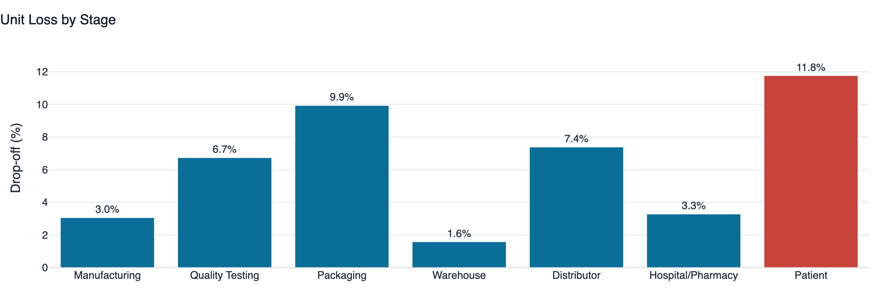 |

Quality Testing is the largest single point of unit loss. It is also the slowest
stage, which is what makes it the binding constraint rather than merely a bad one:

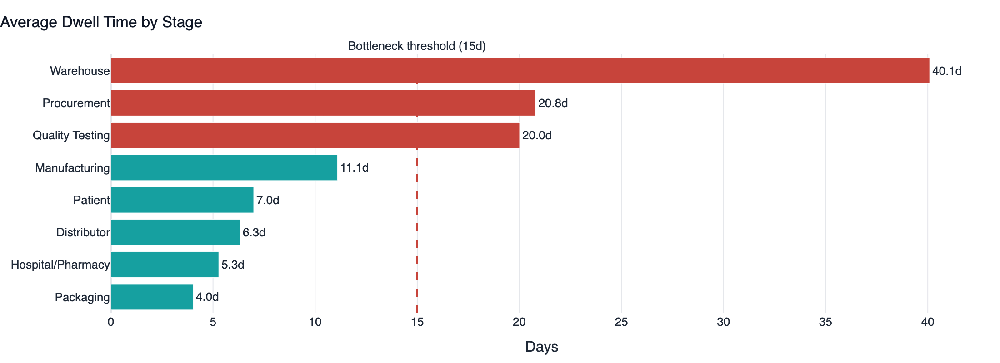

### The sourcing link

QA failure modes cluster on assay and dissolution — raw-material problems, not
process problems. The supplier scorecard shows why:

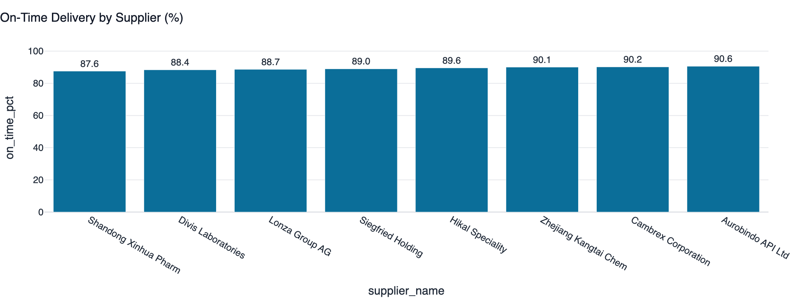

Loss is concentrated, so remediation can be targeted:

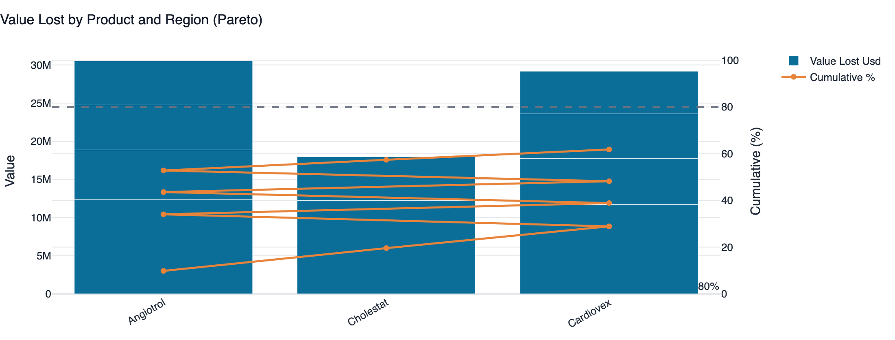

### Experimentation

Four interventions tested. Effect size with its confidence interval, then the value
at stake:

| Control vs treatment | Effect size (95% CI) |
|---|---|
| 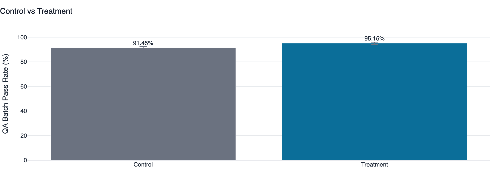 |  |

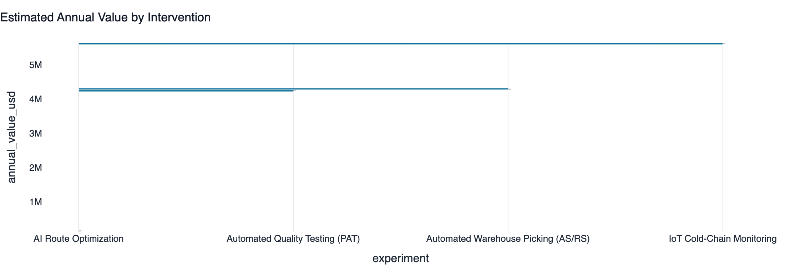

### Stability science

Potency falls with temperature, and the two storage cohorts behave differently —
which is why they are never pooled:

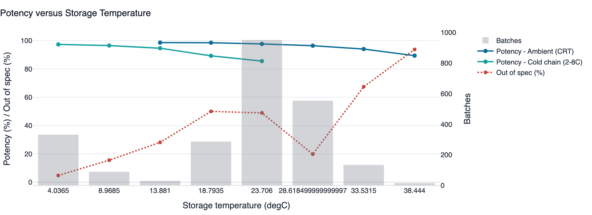

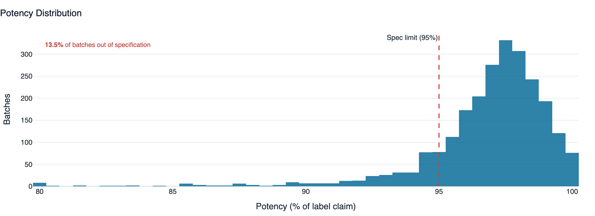

### Machine learning

| Confusion matrix (clinical) | Feature importance (clinical) |
|---|---|
|  | 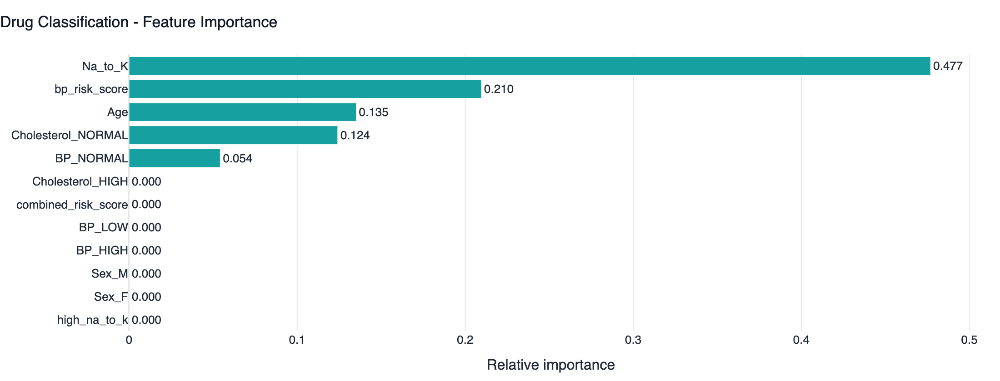 |

`thermal_load` — the engineered temperature × time interaction — is the strongest
predictor of batch risk, ahead of raw storage duration:

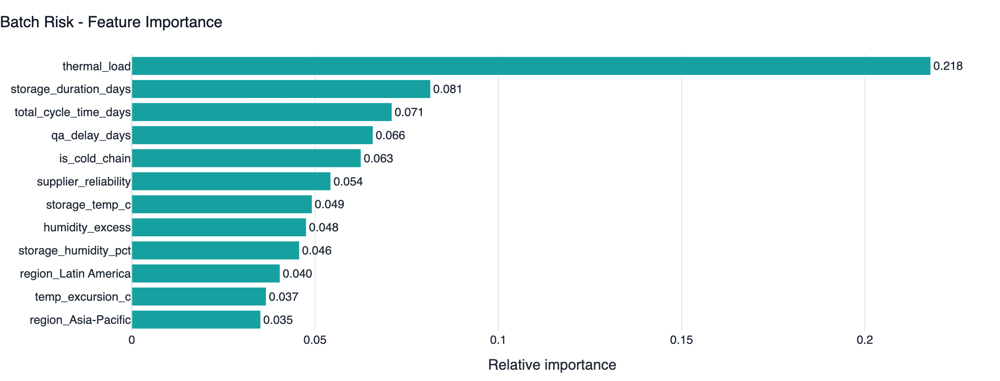

### Forecasting and simulation

| Demand forecast | Decomposition |
|---|---|
| 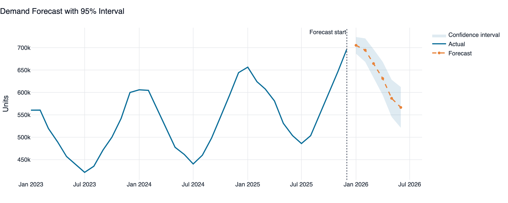 | 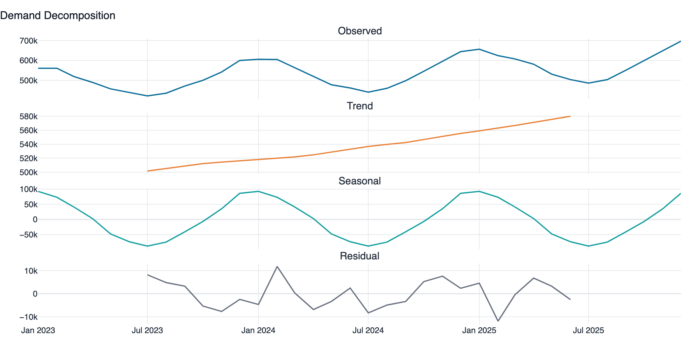 |

Which lever actually moves total cost:

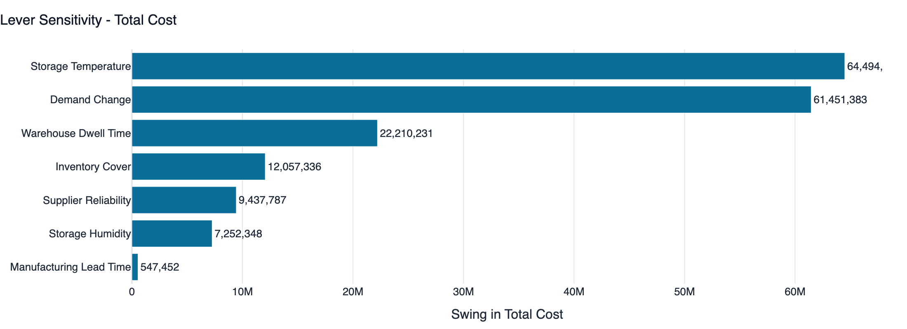

### Data quality and inventory

| Raw-extract quality by dimension | Inventory value concentration |
|---|---|
| 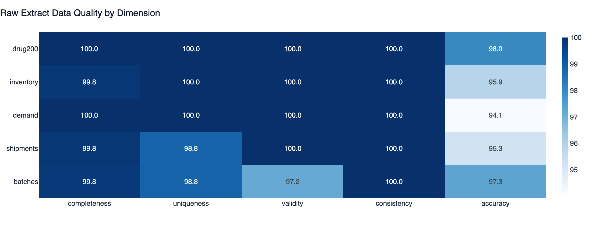 | 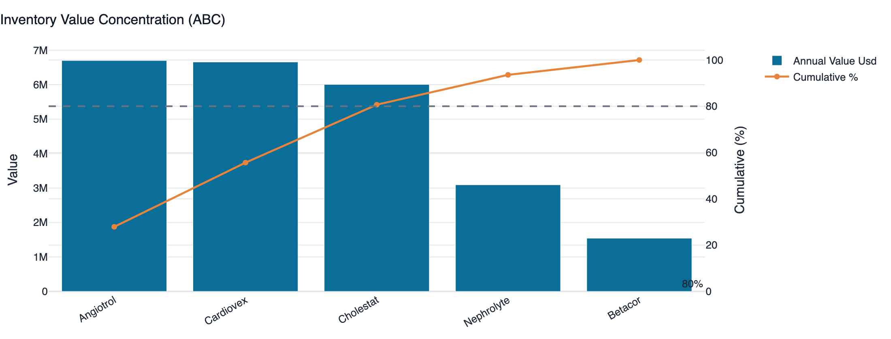 |

---

## Architecture

```
┌──────────────────────────────────────────────────────────────────────────┐
│                          PRESENTATION LAYER                              │
│  app/Home.py + 11 pages   ·   src/dashboard/components.py                │
│  Data Quality · Funnel · Inventory · Shipments · Forecasting · Stability  │
│  A/B Testing · Simulation · ML Models · Insights · Colab                 │
└─────────────────────────────────┬────────────────────────────────────────┘
                                  │
┌─────────────────────────────────▼────────────────────────────────────────┐
│                        VISUALISATION LAYER                               │
│  src/viz/theme.py (palette, Plotly template)                             │
│  src/viz/charts.py (28 reusable chart builders)                          │
└─────────────────────────────────┬────────────────────────────────────────┘
                                  │
┌─────────────────────────────────▼────────────────────────────────────────┐
│                      ANALYTICS & ML LAYER                                │
│  src/analytics/  funnel · inventory · shipments · forecasting            │
│                  stability · ab_testing · simulation                     │
│  src/ml/         preprocess · train · predict                            │
│  src/quality/    assessment (5-dimension scoring)                        │
└─────────────────────────────────┬────────────────────────────────────────┘
                                  │
┌─────────────────────────────────▼────────────────────────────────────────┐
│                            DATA LAYER                                    │
│  SILVER  src/data/cleaning.py   → dedup, canonicalise, range-check, impute│
│  BRONZE  data/raw/*.csv         → raw extract, defects intact             │
│  SOURCE  src/data/generator.py  → seeded digital twin                    │
│          data/raw/drug200.csv   → real Kaggle clinical data              │
│  SQL     src/data/database.py   → SQLite star schema + named queries      │
└─────────────────────────────────┬────────────────────────────────────────┘
                                  │
┌─────────────────────────────────▼────────────────────────────────────────┐
│              FOUNDATION   config/config.yaml · src/config.py              │
│                           src/logger.py                                   │
│              Every threshold declared in one auditable file               │
└──────────────────────────────────────────────────────────────────────────┘
```

### The eight-stage funnel

```
Procurement ─→ Manufacturing ─→ Quality Testing ─→ Packaging
                                       ▲
                                  BOTTLENECK
                             (largest unit loss
                              + slowest stage)

Packaging ─→ Warehouse ─→ Distributor ─→ Hospital/Pharmacy ─→ Patient
```

---

## Datasets

| Dataset | Source | Rows | Role |
|---|---|---|---|
| `drug200.csv` | **Real Kaggle clinical dataset** | 200 | Patient-level drug classification |
| `supply_chain_batches.csv` | Seeded digital twin | ~2,400 | Eight-stage funnel fact table |
| `supply_chain_shipments.csv` | Seeded digital twin | ~7,200 | Three transport legs per batch |
| `supply_chain_inventory.csv` | Seeded digital twin | 1,080 | Monthly warehouse × product snapshots |
| `supply_chain_demand.csv` | Seeded digital twin | 900 | Monthly demand by product × region |
| `dim_drugs` / `dim_suppliers` / `dim_warehouses` | Seeded digital twin | 5 / 8 / 6 | Dimension tables |

### On the supply chain data — stated plainly

`drug200.csv` is genuine Kaggle data. The supply chain tables are **generated**, and
the README says so rather than implying otherwise.

That was a deliberate engineering decision. No public dataset carries batch-level
*funnel telemetry* — per-stage timestamps, per-stage unit yields, storage conditions
and shipment legs on a common key. The alternative was stitching together several
incomplete extracts and pretending the joins were sound. Instead the platform ships
a documented generator with three properties:

1. **Reproducible** — a fixed seed produces byte-identical output. Every figure in
   this README can be re-derived from a clean checkout.
2. **Calibrated** — stage yields, QC release times, cold-chain excursion rates and
   OTIF levels come from published industry benchmarks, all declared in
   `config/config.yaml` rather than buried in code.
3. **Coupled to the real data** — the product mix is derived from the prescription
   distribution observed in `drug200.csv`, so both halves of the platform describe
   the same portfolio.

A useful side effect: because the ground truth is known, the analytics layer can be
*verified*. Four structural signals are planted in the generator, and the test suite
asserts that the analysis recovers each one.

---

## Quick start

```bash
git clone https://github.com/gitPiyush2004/Pharmaceutical-Supply-Chain-Optimization.git
cd Pharmaceutical-Supply-Chain-Optimization

python -m venv .venv
source .venv/bin/activate          # Windows: .venv\Scripts\activate
pip install -r requirements.txt

python scripts/build_dataset.py --summary    # build data layer + SQLite warehouse
python scripts/train_models.py               # train and persist both models
streamlit run app/Home.py                    # launch the dashboard
```

Optional:

```bash
python scripts/run_quality_report.py    # export the data quality Excel workbook
pytest tests/ -q                        # 99 tests, ~8 seconds
```

---

## The dashboard

| Page | What it answers |
|---|---|
| **Home** | Executive summary: yield, value lost, bottlenecks, loss concentration |
| **Data Quality** | Bronze-layer profile, five-dimension scoring, and the measured uplift from cleaning |
| **ML Models** | Both models: algorithm comparison, confusion matrix, ROC/PR, feature importance, live prediction |
| **Funnel Analytics** | Stage conversion, drop-off, dwell time, bottleneck ranking, QA root causes |
| **Inventory** | Turnover, ABC classification, stock-out / overstock / expiry registers, utilisation |
| **Shipments** | Supplier scorecard, regional and carrier performance, transit variance, late analysis |
| **Demand Forecasting** | Three methods selected by backtest; decomposition; forward forecast |
| **Drug Stability** | Temperature / humidity / duration effects, fitted degradation model, excursion significance test |
| **A/B Testing** | Four interventions: z-test, chi-square, t-test, power analysis, segments, costed verdict |
| **Simulation** | Seven live levers propagating through quality, service and cost KPIs |
| **Insights** | Consolidated recommendations with value, confidence and evidence trail |
| **Google Colab** | The full reproducible notebook |

---

## Technical highlights

**Bronze/silver data separation.** `data/raw` holds a realistic *dirty* extract —
IoT logger dropouts, ERP double-postings, free-text region spellings (`APAC`,
`asia pacific`, `Asia-Pacific`), sign errors, trailing whitespace. `src/data/cleaning.py`
promotes it to an analytics-ready layer and emits a full remediation audit trail.
The Data Quality page shows both layers side by side.

**Grouped imputation, not global.** A missing cold-chain storage temperature imputed
with the portfolio median (~25 °C) would fabricate a 20 °C excursion, and that
fabricated excursion would propagate into the stability model, the risk labels and
every downstream conclusion. Imputation is therefore done within group. Where the
true value is *knowable* — `supplier_reliability` is an attribute of the supplier,
not the batch — it is restored by lookup from the dimension table rather than
guessed. A test asserts both behaviours.

**Model selection without leakage.** Three algorithms are grid searched under
identical stratified 5-fold CV and the winner is chosen on **cross-validated** macro
F1. The test set is touched exactly once, to report. On the clinical model, random
forest edges out the decision tree on the test split while the decision tree wins on
CV — the decision tree ships, and the dashboard explains why.

**Feature engineering with a stated rationale.** `thermal_load` (excess temperature ×
exposure days) is the strongest predictor of batch risk, ahead of raw duration —
because degradation depends on temperature and time *jointly*. The interaction is
given to the model explicitly rather than left to be discovered.

**Statistical rigour in the experimentation layer.** Every experiment reports
statistical significance, achieved power *and* practical significance, because a
large sample makes almost any difference significant and that alone never justifies
capital. Chi-square is cross-checked against the z-test (χ² ≈ z² for a 2×2 table).
Segment analyses are labelled exploratory, with the multiple-comparisons risk stated.

**Forecast selection by backtest.** Holt-Winters, linear trend and a naive moving
average are all fitted, and the last six months are held out to pick the winner.
Bias is reported separately from MAPE: persistent over-forecasting becomes expiry
write-off, under-forecasting becomes stock-out, and MAPE hides the direction.

**Configuration as an auditable artefact.** Every threshold — stage yields, ABC
cut-offs, service-level z-scores, A/B effect sizes, economic assumptions — lives in
`config/config.yaml`. No magic numbers in function bodies.

---

## Repository layout

```
├── app/
│   ├── Home.py                      # executive landing page
│   └── pages/                       # 11 analytical pages
├── config/config.yaml               # every threshold, in one place
├── data/
│   ├── raw/                         # bronze layer + drug200.csv
│   └── processed/                   # SQLite warehouse
├── models/                          # joblib pipelines + evaluation metadata
├── notebooks/
│   └── pharmaceutical_ml_pipeline.ipynb
├── reports/                         # exported Excel workbooks
├── scripts/
│   ├── build_dataset.py
│   ├── train_models.py
│   └── run_quality_report.py
├── src/
│   ├── analytics/                   # funnel, inventory, shipments, forecasting,
│   │                                # stability, ab_testing, simulation
│   ├── dashboard/components.py      # shared Streamlit UI toolkit
│   ├── data/                        # generator, loader, cleaning, database
│   ├── ml/                          # preprocess, train, predict
│   ├── quality/assessment.py        # 5-dimension data quality scoring
│   ├── viz/                         # theme + 28 chart builders
│   ├── config.py
│   └── logger.py
├── tests/                           # 99 tests
└── docs/
    ├── ARCHITECTURE.md
    └── INTERVIEW_GUIDE.md
```

---

## Models

### Model 1 — Drug classification (clinical)

| | |
|---|---|
| **Target** | `Drug` (DrugY, drugX, drugA, drugB, drugC) |
| **Features** | Age, Sex, BP, Cholesterol, Na/K + 6 engineered |
| **Selected** | Decision Tree (CV macro F1 = 1.000) |
| **Test accuracy** | 0.98 · macro F1 0.988 · ROC AUC (OvR) 0.989 |
| **Top driver** | `Na_to_K` (~48% of decision weight) |

*Honest framing: 200 rows with a near-deterministic decision rule. High accuracy is
expected and is not evidence of a hard problem solved — the value here is pipeline
rigour, and the model recovering the known clinical rule is a correctness check.*

### Model 2 — Batch risk classification (supply chain)

| | |
|---|---|
| **Target** | `batch_risk_label` (Low / Medium / High) |
| **Features** | Storage conditions, cycle time, QA delay, supplier reliability + engineered |
| **Selected** | XGBoost (CV macro F1 = 0.678) |
| **Test accuracy** | 0.745 · macro F1 0.702 · ROC AUC (OvR) 0.866 |
| **Top driver** | `thermal_load` (~22%) |

*Honest framing: macro F1 near 0.70 reflects genuine irreducible noise — the label
depends partly on stochastic QA outcomes. A materially higher score would indicate
leakage rather than skill.*

---

## Tech stack

**Data** pandas · NumPy · SQL (SQLite) · openpyxl
**ML** scikit-learn · XGBoost · joblib
**Statistics** SciPy · statsmodels
**Visualisation** Plotly · Matplotlib
**Application** Streamlit
**Quality** pytest · PyYAML

---

## Limitations

Stated up front rather than discovered by a reader:

- The supply chain data is a **seeded digital twin**, not a production extract. It
  demonstrates method; it does not describe a real company.
- The A/B tests are **simulated experiments** with effect sizes drawn from published
  benchmarks. They demonstrate the decision framework, not measured outcomes.
- Value figures are **gross benefit** — they exclude implementation cost, change
  management and capital expenditure, so they are not an ROI.
- The simulation is a **first-order elasticity model**, not discrete-event. No
  queueing, capacity constraints or stochastic variance.
- The shelf-life estimate is an analytical result from observed outcomes, **not a
  regulatory determination** — that requires formal ICH stability studies.

## Next steps

1. **Cost the interventions** — convert gross benefit to NPV and re-rank on ROI.
2. **Sequential testing** — adopt clear winners early without inflating alpha.
3. **Survival analysis for shelf life** — Cox regression handles censoring properly.
4. **Multi-echelon inventory optimisation** — optimise safety stock across the
   network jointly rather than position by position.
5. **Discrete-event simulation** — verify that compressing QA does not simply move
   the bottleneck downstream.

---

## Documentation

- **[docs/ARCHITECTURE.md](docs/ARCHITECTURE.md)** — module responsibilities, data
  flow, and the design decisions behind them
- **[docs/INTERVIEW_GUIDE.md](docs/INTERVIEW_GUIDE.md)** — how to present this
  project, with the technical questions it invites and how to answer them

## Reproducibility

Everything is deterministic under `project.random_seed` in `config/config.yaml`. A
clean checkout reproduces every figure in this README. If a number you generate
differs, that is a bug worth reporting — not expected variance.

## Author

**Piyush Bhatia** — built as a portfolio project demonstrating end-to-end analytics
engineering: data quality, ML pipelines, statistical experimentation and decision
support in a regulated-industry context.
