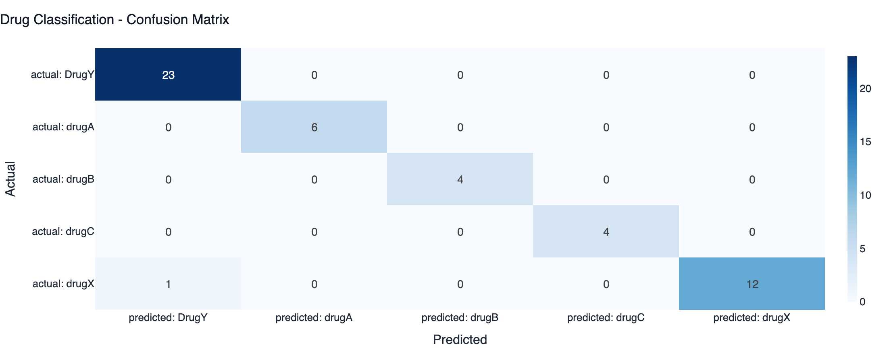
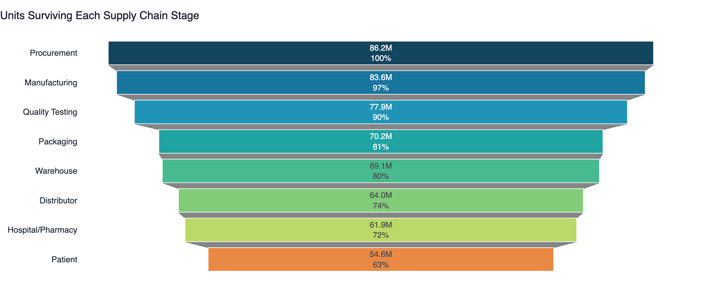
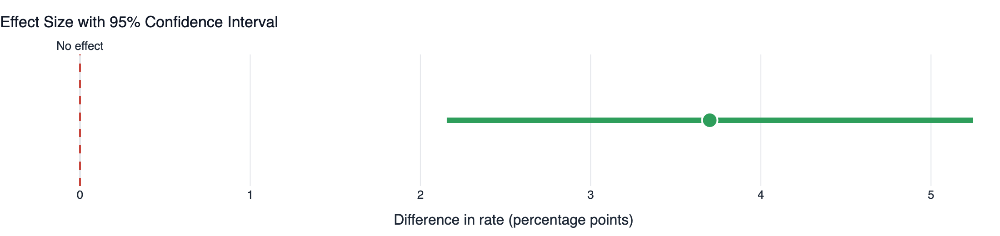
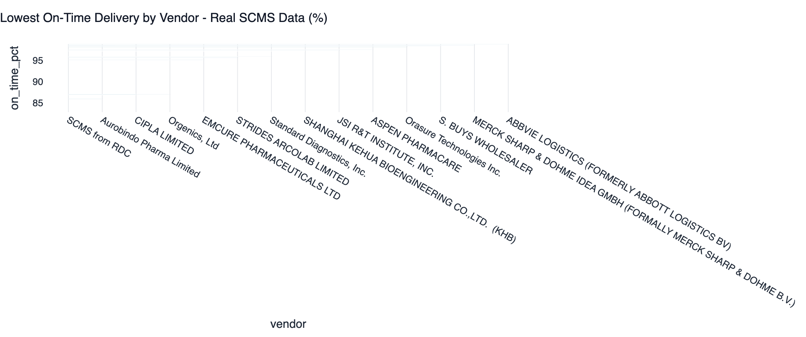

# Pharmaceutical Supply Chain Optimization

### Drug Classification · Funnel Analytics · A/B Testing

An end-to-end analytics platform on pharmaceutical data: a machine learning
pipeline that recommends drugs from patient clinical readings, a supply chain
funnel analysis that finds where value is lost, and statistical A/B tests that
prove which fixes actually work.

[](https://www.python.org/)
[](https://scikit-learn.org/)
[](https://streamlit.io/)
[](tests/)
[](https://colab.research.google.com/github/gitPiyush2004/Pharmaceutical-Supply-Chain-Optimization/blob/main/notebooks/drug_classification_pipeline.ipynb)

---

## Quick start

```bash
git clone https://github.com/gitPiyush2004/Pharmaceutical-Supply-Chain-Optimization.git
cd Pharmaceutical-Supply-Chain-Optimization
pip install -r requirements.txt

python scripts/build_dataset.py    # build the data layer
python scripts/train_models.py     # train the models
streamlit run app/Home.py          # launch the dashboard
```

---

## 1 · Drug Classification (Machine Learning)

**The problem.** Predict which of five drugs suits a patient from their age, sex,
blood pressure, cholesterol and sodium-to-potassium ratio.

**Dataset.** Kaggle `drug200` — 200 patients, 5 features, 5 classes.

**The pipeline**

| Step | What it does |
|---|---|
| Data quality report | Detects missing values, duplicates, invalid categories and impossible values |
| Cleaning | Median imputation for numerics, mode for categoricals, range checks, deduplication |
| Feature engineering | Ordinal risk scores, combined severity score, Na/K threshold flag, age bands |
| Encoding & scaling | One-hot for nominal, ordinal where order matters, standardisation — all in one sklearn `Pipeline` |
| Model | **Decision Tree with balanced class weights** (classes are imbalanced 5.7:1) |
| Evaluation | Confusion matrix, per-class ROC/AUC, macro-averaged metrics, error analysis |

**Results:** 98% test accuracy · 0.988 macro F1 · 0.98+ AUC on every class.



**The finding worth talking about.** The single misclassified patient was predicted
with **100% confidence**. A Decision Tree grown to pure leaves reports every
prediction as certain, so its probabilities carry no information — which means the
obvious safety net (escalate low-confidence cases to a pharmacist) can't be built
until they're calibrated. That surfaced from the error analysis; reporting 98%
accuracy and stopping would have hidden it.

> 98% accuracy on 200 rows with a near-deterministic rule is **expected**, not
> impressive. What this section demonstrates is pipeline rigour: leakage control,
> stratification, class balancing and honest evaluation.

---

## 2 · Supply Chain Funnel Analytics

Every batch is traced through eight stages, measuring where volume and value leak.



**Finding.** Only ~63% of procured units reach a patient. **Quality testing is the
binding constraint** — it loses the most volume *and* is the slowest stage
(~19 days). Its failure modes cluster on assay and dissolution problems, which
trace back to incoming raw material rather than the manufacturing process.

---

## 3 · Statistical A/B Testing

Four operational interventions tested. Each must clear three bars before it
justifies capital:

1. **Statistical significance** — two-proportion z-test and chi-square
2. **Adequate power** — could the test have detected the effect if it existed?
3. **Practical significance** — is the lift big enough to matter commercially?



A large sample makes almost any difference significant. That alone is never a
reason to spend money, which is why all three are reported.

---

## 4 · Real-World Data (USAID SCMS)

**10,324 actual pharmaceutical shipments** to 43 countries, 2006–2015 — real US
Government open data, covering $1.63B of commodity value across 73 vendors.



**Finding.** I built this scorecard expecting a weak manufacturer. The worst
performer is **"SCMS from RDC"** — an *internal* distribution channel, not a
supplier at all, carrying $1.09B of commodity value.

But the pooled number is misleading, and that's the more interesting part. Stratified
by time period, the gap against direct-drop fulfilment is **+1.9 points before 2011
and +20.5 points after**:

| Era | Direct Drop | From RDC | Gap |
|---|---|---|---|
| 2006–2010 | 95.3% | 93.4% | +1.9 pp |
| 2011–2015 | 94.4% | **73.9%** | +20.5 pp |

This is Simpson's paradox. The channel didn't start weak — it **collapsed after
2010**. Quoting the pooled 11.9-point gap describes a permanent structural problem
that never existed, and points at the wrong fix: this is a degradation to
investigate, not a channel to replace.

**A late-delivery model** trained on these shipments reaches **ROC AUC 0.84** —
but its accuracy sits *below* the majority-class baseline, because only 11.5% of
shipments are late. Accuracy is the wrong metric, so the model is deployed as a
ranking instead:


Review the top 20% by predicted risk and you catch **63% of all late deliveries** —
3.2× better than random. That's an expeditor's work queue, not a yes/no gate.

---

## Data sources

| Dataset | Type | Used for |
|---|---|---|
| Kaggle `drug200` | **Real** — 200 patients | Drug classification model |
| [USAID SCMS](https://www.kaggle.com/datasets/sawandikirby/supply-chain-shipment-pricing-data) | **Real** — 10,324 shipments | Vendor, logistics and late-delivery analysis |
| Manufacturing tables | **Simulated** — seeded, benchmark-calibrated | Funnel, stability and A/B testing |

The manufacturing data is simulated because SCMS records procurement and logistics
but not manufacturing, and no public dataset carries per-batch storage telemetry.
**Every simulated figure is labelled as simulated**, in the dashboard and here.

A useful side effect: because the simulation's ground truth is known, four
structural findings are planted in it and the test suite asserts the analysis
recovers all four.

---

## The dashboard

Nine pages, each with one job:

| Page | Purpose |
|---|---|
| **Home** | Executive summary |
| **Data Quality** | Profiling, cleaning and the audit trail behind every number |
| **ML Models** | All three models with full evaluation and live prediction |
| **Funnel Analytics** | Stage conversion, drop-off and bottleneck ranking |
| **Drug Stability** | How storage conditions destroy potency |
| **Real-World Operations** | Measured performance on the real USAID shipments |
| **A/B Testing** | Four interventions tested for significance |
| **Insights** | Consolidated recommendations |
| **Google Colab** | The reproducible notebook |

---

## Tech stack

**Python** · pandas · NumPy · scikit-learn · XGBoost · SciPy · statsmodels ·
Plotly · Streamlit · SQL (SQLite) · joblib · pytest

## Project structure

```
├── app/                 # Streamlit dashboard (Home + 8 pages)
├── config/config.yaml   # every threshold, in one auditable file
├── data/                # raw, external (real SCMS) and processed
├── models/              # serialised pipelines + evaluation metadata
├── notebooks/           # the drug classification pipeline
├── scripts/             # build_dataset · train_models · run_quality_report
├── src/
│   ├── analytics/       # funnel · stability · ab_testing · procurement
│   ├── data/            # scms · generator · cleaning · loader · database
│   ├── ml/              # preprocess · train · predict
│   ├── quality/         # 5-dimension data quality scoring
│   └── viz/             # theme + chart builders
└── tests/               # 104 tests
```

## Limitations

- Manufacturing data is **simulated**; it demonstrates method, not a real company.
- A/B tests are **simulated experiments** — the framework is real, the outcomes
  are not measured.
- Value figures are **gross benefit**, excluding implementation cost. Not an ROI.
- The real SCMS data ends in **2015**.

## Documentation

- **[docs/ARCHITECTURE.md](docs/ARCHITECTURE.md)** — module design and the
  reasoning behind each decision
- **[docs/INTERVIEW_GUIDE.md](docs/INTERVIEW_GUIDE.md)** — how to present this
  project

---

**Piyush Bhatia** — a portfolio project demonstrating end-to-end analytics
engineering: data quality, ML pipelines, statistical experimentation and decision
support.
